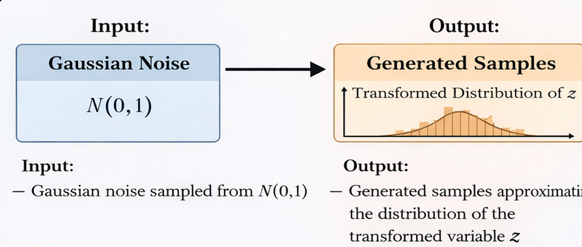
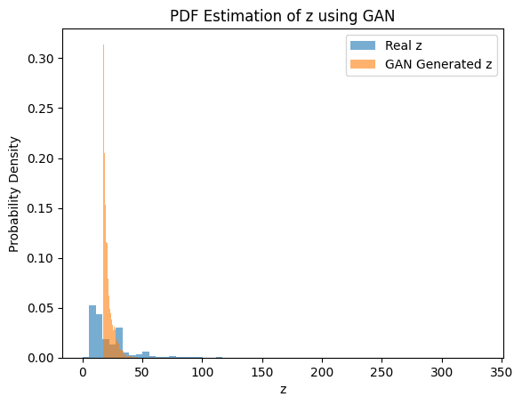

# **Title: Learning Probability Density Functions using GAN**

## **1. Methodology**

  

**Workflow:**

Data Collection → Data Transformation → GAN Training → Sample Generation → PDF Estimation → Result Analysis

## **2. Dataset Description**

## Dataset
The dataset used in this assignment is publicly available at:
https://www.kaggle.com/datasets/shrutibhargava94/india-air-quality-data

  

- Dataset: India Air Quality Dataset (Kaggle)
- Feature Used: NO₂ concentration
- Number of Samples: Based on available non-missing NO₂ values
- Transformation Applied:
  \[
  z = x + a_r \sin(b_r x)
  \]
- Roll Number: **102317270**
- Transformation Parameters:
  - \( a_r = 1.5 \)
  - \( b_r = 0.3 \)
- Model Used: Generative Adversarial Network (GAN)
- PDF Estimation Method: Histogram-based density estimation

## **3. Input / Output**

  

**Input:**  
- Gaussian noise sampled from \( N(0,1) \)

**Output:**  
- Generated samples approximating the distribution of the transformed variable `z`

## **4. PDF Plot from GAN Samples**

  

The plot shows the comparison between the real transformed data distribution and the distribution learned by the GAN using generated samples.

## **5. Observations**

- **Training Stability:**  
  Minor fluctuations are observed during early training, followed by stable convergence.

- **Quality of Generated Distribution:**  
  Generated samples closely follow the overall shape and spread of the real data distribution.

