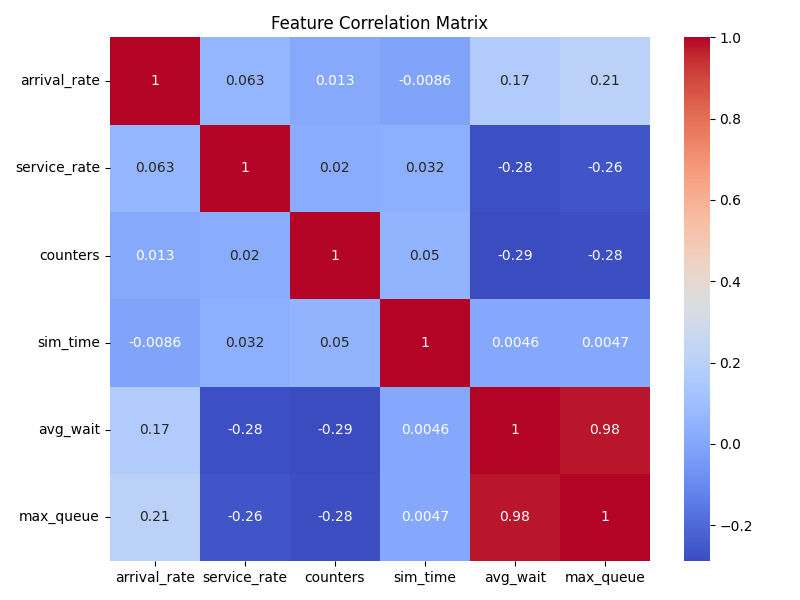
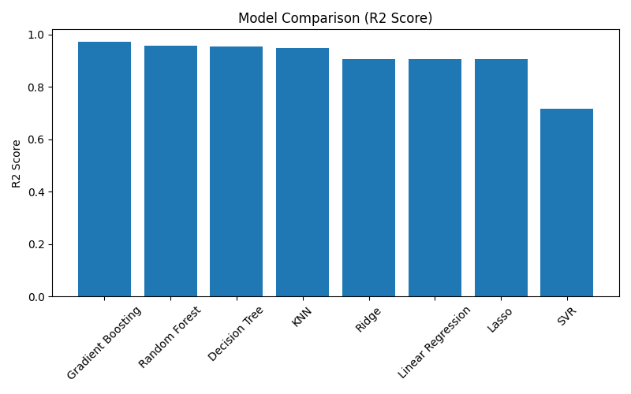

# Data Generation through Modeling and Simulation for Machine Learning

## Project Overview

This project illustrates how synthetic datasets can be generated using simulation techniques and subsequently applied to train and evaluate multiple machine learning models.

A traffic toll queue system was simulated using SimPy, and 1000 independent simulations were executed with randomized parameter values. The primary objective was to predict the average waiting time of vehicles using regression-based machine learning models.

# Simulation Framework

The system models a toll booth environment where:
- Vehicles arrive at random intervals (arrival rate)
- Service times vary randomly (service rate)
- Multiple service counters operate simultaneously
- The system runs for a predefined simulation duration

## Parameter Ranges
| Parameter       | Minimum | Maximum |
| --------------- | ------- | ------- |
| Arrival Rate    | 1       | 10      |
| Service Rate    | 2       | 15      |
| Counters        | 1       | 5       |
| Simulation Time | 100     | 500     |

# Generated Dataset

A total of 1000 simulation runs were performed to create the dataset.

Each record includes:
- Arrival Rate
- Service Rate
- Number of Counters
- Simulation Time
- Average Waiting Time (Target Variable)
- Maximum Queue Length

The dataset captures the impact of system configuration on congestion and waiting time.

# Correlation Analysis

The correlation heatmap below illustrates the relationships among system variables:

  

# Key Insights
- Higher arrival rates are associated with increased waiting times.
- Increasing service rates reduces overall waiting time.
- A greater number of service counters significantly decreases congestion levels.

# Machine Learning Models

Eight regression algorithms were implemented and evaluated:
- Linear Regression
-Ridge Regression
-Lasso Regression
-Decision Tree Regressor
-Random Forest Regressor
-Gradient Boosting Regressor
-Support Vector Regressor (SVR)
-K-Nearest Neighbors (KNN)

## Evaluation Metrics

Models were assessed using:

- Mean Absolute Error (MAE)
- Mean Squared Error (MSE)
- Root Mean Squared Error (RMSE)
- R² Score

# Model Performance Comparison

  

Among all models, Gradient Boosting demonstrated the strongest predictive performance based on the highest R² score and lowest error metrics.

# Best Performing Model

## Gradient Boosting Regressor
- Achieved the highest R² score
- Produced the lowest prediction errors
- Effectively captured non-linear relationships within the simulated system

# Conclusion

This project highlights the integration of:
- Simulation-based modeling
- Synthetic data generation
- Machine learning model evaluation
- Comparative performance analysis

The results indicate that ensemble-based approaches outperform linear models, suggesting the presence of complex non-linear interactions within the simulated traffic system.
