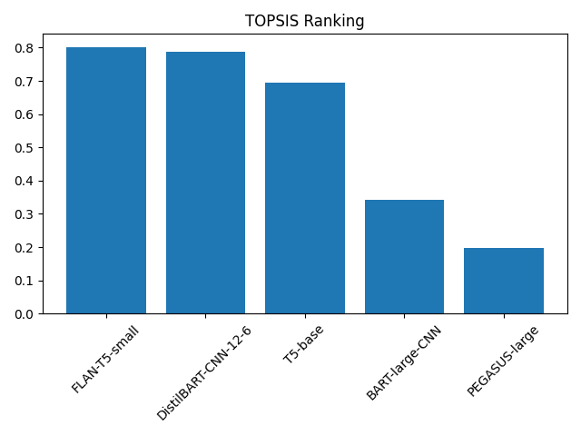
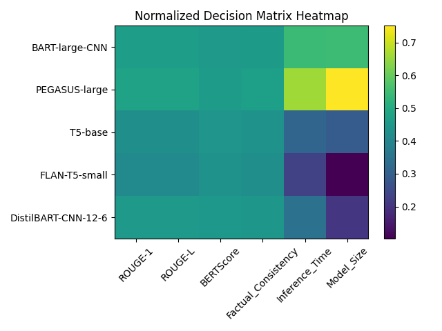

# Model Selection Using TOPSIS for Pre-Trained Text Summarization Systems
## Project Overview

This project implements the TOPSIS (Technique for Order Preference by Similarity to Ideal Solution) method to systematically rank pre-trained text summarization models using a multi-criteria decision-making framework.

Rather than relying on a single evaluation metric such as ROUGE, this approach considers multiple performance and computational factors simultaneously to identify the most balanced and practically optimal model.

# Motivation

Choosing an appropriate text summarization model involves trade-offs between:
- Summary generation quality
- Semantic alignment
- Factual consistency
- Inference latency
- Model size and computational cost

Certain criteria should be maximized (e.g., ROUGE, BERTScore), while others should be minimized (e.g., runtime and memory footprint).

TOPSIS offers a structured mathematical approach to evaluate alternatives by measuring their relative closeness to an ideal best and ideal worst solution.

# Models Evaluated

To ensure meaningful diversity in architecture and efficiency, the following pre-trained models were compared:
- BART-large-CNN
- PEGASUS-large
- T5-base
- FLAN-T5-small
- DistilBART-CNN-12-6

These models vary significantly in size, design, and performance characteristics.

# Evaluation Criteria

| Criterion            | Category    | Optimization Goal |
| -------------------- | ----------- | ----------------- |
| ROUGE-1              | Benefit (+) | Maximize          |
| ROUGE-L              | Benefit (+) | Maximize          |
| BERTScore            | Benefit (+) | Maximize          |
| Factual Consistency  | Benefit (+) | Maximize          |
| Inference Time (sec) | Cost (-)    | Minimize          |
| Model Size (MB)      | Cost (-)    | Minimize          |

# Assigned Weights

The relative importance of each criterion is defined by the weight vector:

[0.20, 0.15, 0.25, 0.20, 0.10, 0.10]

Higher weights are assigned to semantic and factual quality metrics, while still accounting for computational efficiency.

Total weight = 1.00

# Impact Vector

[+, +, +, +, -, -]

- “+” denotes criteria to be maximized
- “–” denotes criteria to be minimized

# TOPSIS Procedure

The ranking methodology follows these steps:
1) Construct the decision matrix
2)Perform vector normalization
3) Apply criterion weights
4) Identify the ideal best and ideal worst solutions
5) Compute Euclidean distances from both ideals
6) Calculate the closeness coefficient

The final TOPSIS score is calculated as:
Ci = S⁻ / (S⁺ + S⁻)

Where:
- S⁺ = Distance from the ideal best
- S⁻ = Distance from the ideal worst

A higher closeness coefficient indicates a more desirable alternative.

# Repository Structure

```
topsis_pretrained/
│
├── data/
│   └── decision_matrix.csv
│
├── notebook/
│   └── analysis.ipynb
│
├── output/
│   ├── closeness_bar_chart.png
│   ├── rouge_comparison.png
│   ├── inference_time_comparison.png
│   └── normalized_heatmap.png
│
├── results/
│   └── topsis_scores.csv
│
└── README.md
```

# Visual Analysis
## Final Ranking

The closeness coefficients are visualized using a bar chart to illustrate the ranking of models.

<p align="center">
  
</p>

## Normalized Decision Matrix

A heatmap representation highlights how each model performs across normalized criteria.

<p align="center">
  
</p>

## Results

The computed TOPSIS scores and final rankings are available in:

results/topsis_scores.csv

The model with the highest closeness coefficient is considered the most balanced choice when accounting for both quality and computational efficiency.

# Why Use TOPSIS?
- Effectively manages conflicting evaluation criteria
- Provides a transparent and quantitative ranking method
- Balances accuracy and computational constraints
- Suitable for real-world model selection scenarios

